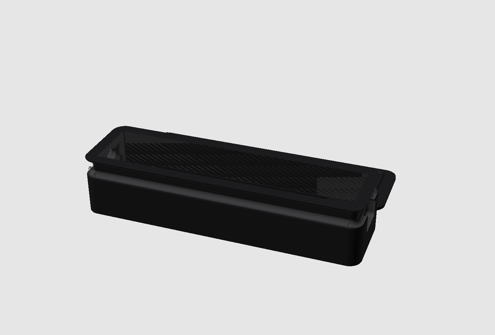
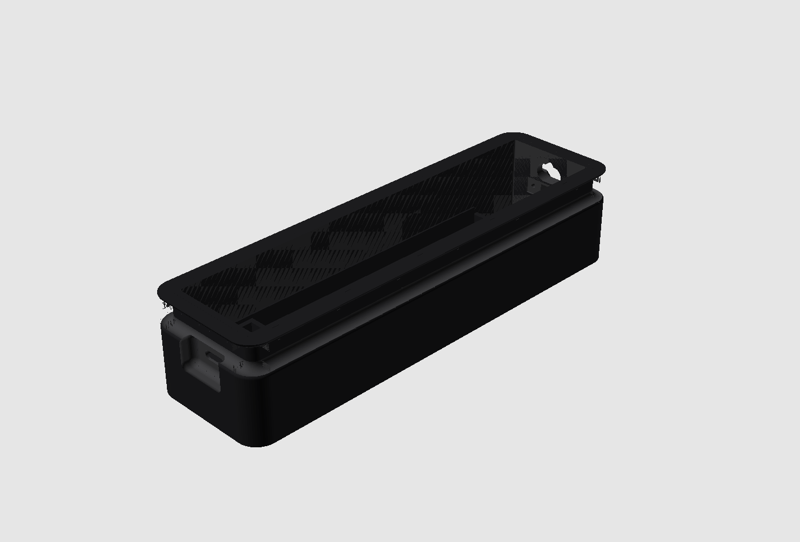
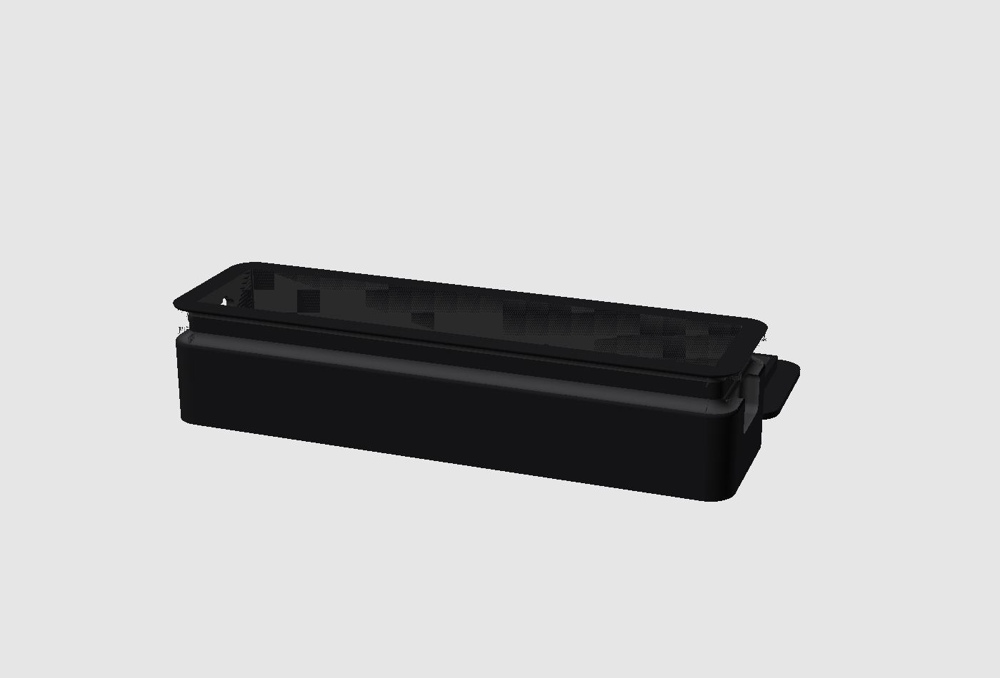
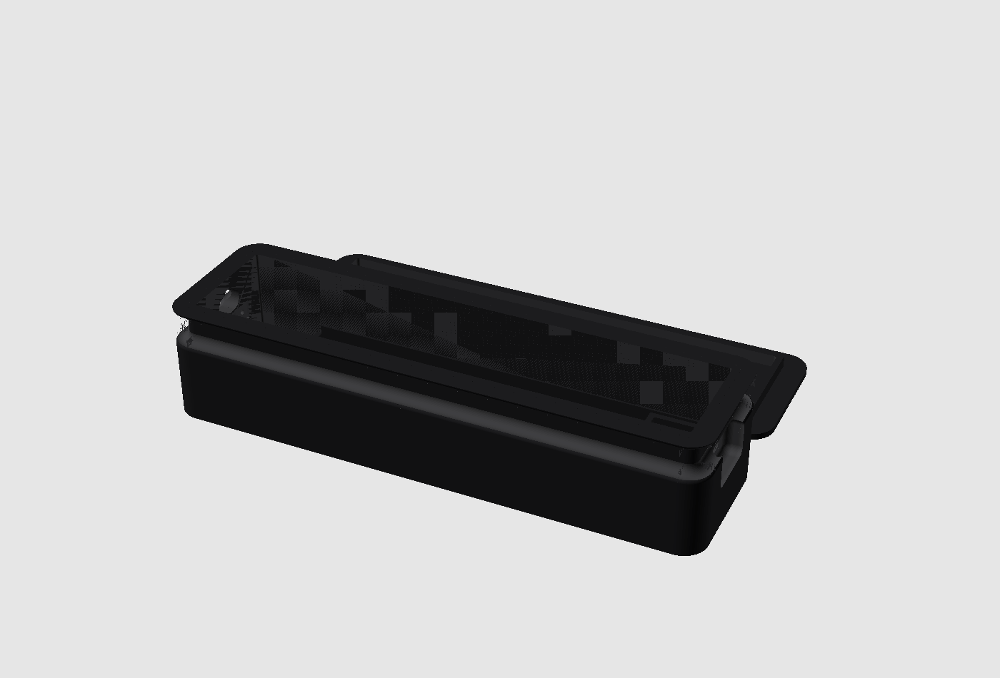
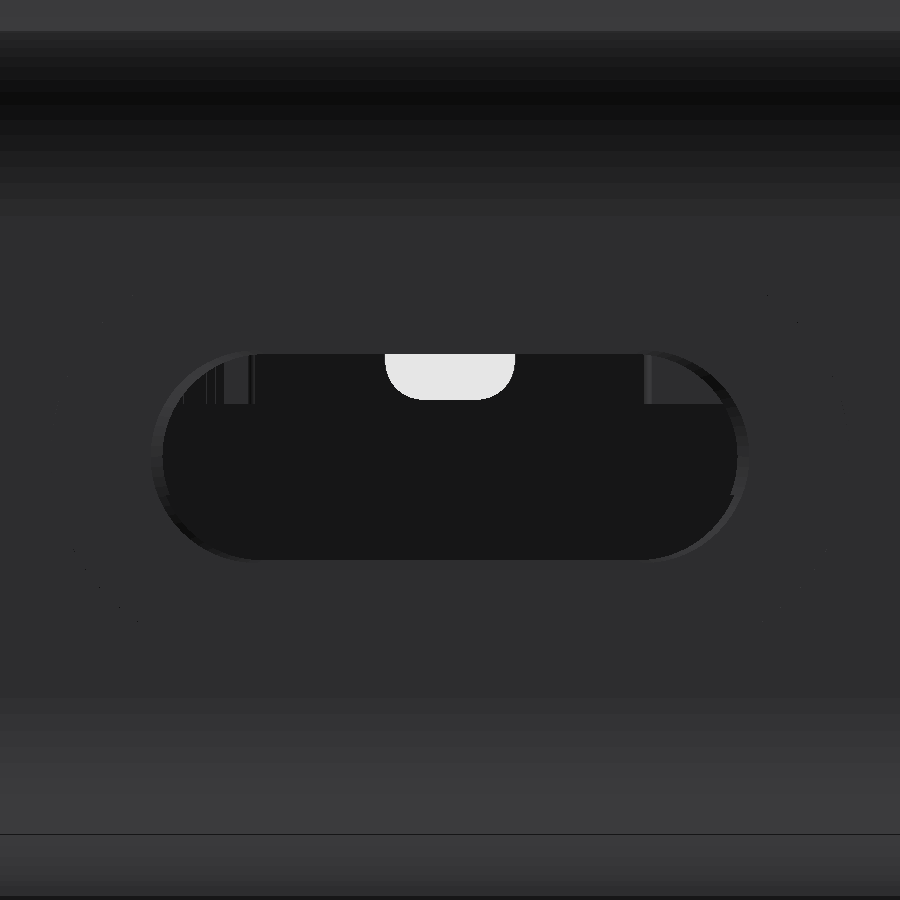
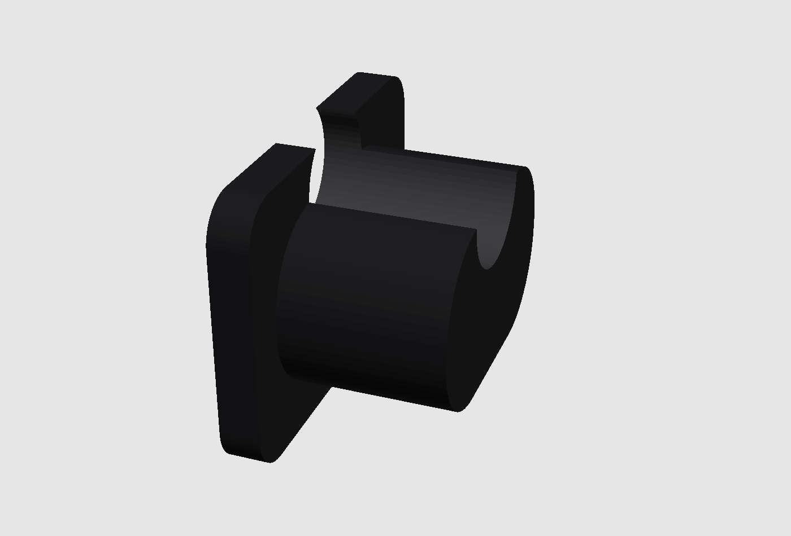

# Pixel Status (ESP8266 + MAX7219)

Eine physische Statusanzeige für den Schreibtisch: eine rote 32×8-Punktmatrix aus
vier MAX7219-Modulen, angetrieben von einem ESP8266. Sie zeigt vordefinierte Stati
wie „On Air" oder „In a Call", freien Lauftext, einen Countdown-Timer oder die
Uhrzeit. Angesteuert wird sie wahlweise über die eingebaute **Web-Oberfläche**,
per **MQTT** für bestehende Automatisierungen (inkl. automatischer
**Home-Assistant-Erkennung**), oder direkt per **USB-Kabel** ganz ohne WLAN – alle
drei Wege laufen intern über denselben zentralen Befehls-Dispatcher. Ein
Home-Assistant-Setup ist dafür nicht nötig, lässt sich aber ohne weitere
Konfiguration anschließen.

> Hinweis: Der ESP8266 kann **kein Bluetooth** (nur der ESP32). Drahtlos läuft die
> Übertragung über WiFi; alternativ direkt per USB-Kabel (seriell).

Dieses Dokument führt komplett durch das Projekt: Bauteile & Kosten, das
3D-gedruckte Gehäuse, den Zusammenbau, das eingebaute Minispiel „Pixel Attack",
die MQTT-/Home-Assistant-Anbindung und die Companion-App. Wer nur die Firmware
flashen will, kann direkt zu [Firmware einrichten](#firmware-einrichten) springen.

## Funktionen

- **Presets & freier Text** — On Air, In a Call, Busy, BRB per Klick, oder
  eigener Text (statisch oder scrollend, inkl. Umlaute)
- **Timer & Uhrzeit** — Countdown oder Stoppuhr (pausier-/fortsetzbar),
  NTP-synchronisierte Uhr (läuft auch ohne WLAN per manuell gesetzter Zeit)
- **Pixel Attack** — ein kleines Space-Invaders-artiges Easter-Egg direkt auf
  der Matrix, spielbar per Tastatur oder Handy-Touch (siehe
  [eigenes Kapitel](#pixel-attack-spielen))
- **Darstellung** — persistente Helligkeit, 0°/180°-Drehung für kopfüber
  montierte Geräte, wählbare Scrollrichtung
- **Einschalt-Animationen** — Scan-Wipe, Pixel-Fill, oder ein Fortschrittsbalken,
  der live am echten WLAN-Verbindungsaufbau hängt
- **Zwei Zusatz-LEDs** — unabhängig schaltbar, mit Helligkeitsregler,
  Wechselblinken und automatischer Warnung in den letzten Timer-Minuten
- **Akkubetrieb** — 1S-LiPo mit Ladeüberwachung, Live-Prozentanzeige,
  automatische Dimmung bei niedrigem Ladestand; die Stromversorgung des Geräts,
  kein Zubehör (siehe [Bauteile-Liste](#bauteile-liste--ca-kosten))
- **Sicherer Setup-Hotspot** — findet sich kein bekanntes WLAN, öffnet sich ein
  Hotspot mit geräteeigenem, auf der Matrix angezeigtem Passwort
- **Web-UI** — Deutsch/Englisch umschaltbar, automatischer Dark Mode,
  Live-Diagnoseseite (Heap, CPU-Last, WLAN-Signal, Akkuverlauf)
- **MQTT mit Home-Assistant-Autoconfig** — Entitäten für Status, LEDs, Text,
  Helligkeit und Diagnose erscheinen automatisch in HA (siehe
  [eigenes Kapitel](#mqtt--home-assistant-integration))


## Komponenten (Software)

### Firmware (dieses Repo, `src/`)

Läuft komplett eigenständig auf dem ESP8266. Sauber in kleine Klassen mit je
einer Verantwortlichkeit aufgeteilt — Anzeige, LEDs, Netzwerk, Uhrzeit, MQTT,
Web-Server und USB-Protokoll laufen alle über denselben zentralen
Befehls-Dispatcher (`Commands.h`), damit sich neues Verhalten nur an einer
Stelle definieren lässt. WLAN- und MQTT-Zugangsdaten sind zur Laufzeit über das
Web-Portal einrichtbar, ganz ohne Neu-Flashen.

### Companion-App ([`companion/`](companion/README.md))

Eine schlanke Tauri-v2-Tray-App für Windows/macOS: Status per Klick aus dem
Menüleisten-Icon setzen, ohne den Browser aufzumachen. Verbindet sich wahlweise
per WLAN oder direkt per USB-Kabel mit demselben Gerät, erkennt Mikrofonnutzung
automatisch und schaltet selbstständig auf „In a Call".

---

## Bauteile-Liste & ca. Kosten

Alle Preise sind grobe Richtwerte für Einzelstücke auf dem üblichen
Bastler-Marktplatz-Niveau (AliExpress/eBay/Amazon), **ohne Versand** — je nach
Anbieter, Region und Bestellmenge kann es deutlich abweichen. Der Akku ist die
Stromversorgung des Geräts (No-Shift-Topologie, siehe
[Aufbau & Verkabelung](#aufbau--verkabelung)) und damit fester Bestandteil der
Liste, kein Zubehör — ohne ihn läuft nur der ESP8266 selbst über USB (zum
Flashen), die Matrix bleibt dunkel. Vollständige Stückliste inkl. Werkzeug
zusätzlich in [`hardware/wiring/parts-list.md`](hardware/wiring/parts-list.md).

| Teil | Menge | ca. Kosten | Hinweis |
|---|---|---|---|
| ESP8266-Board (Wemos D1 mini oder NodeMCU v2) | 1× | 4–6 € | beide Varianten werden von der Firmware unterstützt |
| MAX7219-LED-Matrix 32×8 (4-in-1-Modul) | 1× | 7–10 € | vier MAX7219 onboard durchgekettet, ein 5-poliger Eingang |
| 1S-LiPo, 2000 mAh | 1× | 7–9 € | 51 × 33 × 10 mm |
| TP4056/TP4057-Lademodul | 1× | 1–2 € | Lader + Schutz-IC |
| LDO-Breakout, 3,3 V | 1× | 1–2 € | Versorgung des ESP8266 aus der Akkuschiene |
| Schiebeschalter, geflanscht (z. B. SS-12F15-G070) | 1× | 1–2 € | Haupt-Ein/Aus, Panel-Mount |
| Diode 1N5817, Elko 1000 µF/10 V, Widerstände 100 kΩ/220 kΩ, Keramik-Cs | je 1–2× | 2–3 € | Rückspeisungsschutz, Pufferung, Akku-Spannungsteiler |
| USB-Kabel (Micro-USB oder USB-C, je nach Board) | 1× | 3–5 € | zum Flashen und Laden |
| Dünne Litze / Jumper-Kabel | ein paar | 1–2 € | Brücken zwischen den Modulen |
| Gehäuse (3D-Druck, PLA) | 1 Satz | 2–3 € | reine Filamentkosten, siehe [Gehäuse-Kapitel](#gehäuse-3d-modell--druck) |
| 2× 5-mm-LED + Vorwiderstand (220–330 Ω) | je 1 Satz | ~1 € | optional, aber von der Firmware vorgesehen (Zusatz-LEDs) |

**Summe: ca. 32–45 €**

### Werkzeug (kein Verbrauchsmaterial, meist schon vorhanden)

Lötkolben + Lötzinn, Multimeter (Pflicht vor jedem Einschalten), Seitenschneider
+ Abisolierzange, Schrumpfschlauch oder Isolierband, ein kleiner Schraubendreher
für die Schalter-Befestigung. Details siehe Stückliste oben.

---

## Gehäuse: 3D-Modell & Druck

Das Gehäuse ([`hardware/case/`](hardware/case/)) ist ein **parametrisches
OpenSCAD-Modell** — `case.scad` — entworfen und getestet auf einem **Bambu Lab
P1S in PLA**. Zwei Hauptteile plus ein kleines Zubehörteil:

- **`body`** — Front-Blende und Wanne in einem Stück; alle Komponenten werden
  von **hinten** eingesetzt.
- **`cover`** — Rückdeckel, klippt/reibt auf den Body.
- **`feed_plug`** — kleiner Verschluss-Stopfen für die Kabeldurchführung, durch
  die das Steuerkabel (USB) nach außen geführt wird.



### Ein paar Design-Entscheidungen

- **Druckorientierung**: Der Body druckt mit dem **LED-Fenster nach unten**
  auf dem Druckbett — spart Stützstrukturen genau dort, wo sie die Optik am
  meisten stören würden. Der schräge Ladeteil-Halter (45°) druckt dabei ohne
  eigene Stützen mit.
- **Ladeteil-Halterung**: Eigens konstruierter 45°-Schräghalter — alles hinter
  der Matrix muss strikt hinter deren Bautiefe bleiben, sonst kollidiert es.
- **Kabelaufwicklung**: Ein eingelassener Kragen mit rundem Nutprofil, dazu
  eine Keyhole-Durchführung mit Klemmschlitz als Zugentlastung und dem
  steckbaren `feed_plug` als Verschluss.
- **USB-C-Öffnung**: Stadionform statt scharfem Rechteck, mit Senkung außen
  für den Steckerkörper.
- **Status-LED-Bucht**: Gehäuse eigens verbreitert, damit zwei 5-mm-LEDs im
  Presssitz neben der Matrix Platz finden.
- **Aufstellung**: Bewusst kein Standfuß, keine Wandhalterung — ein
  kompakter, freistehender Baukörper.

| Innenansicht (Ladeteil-Halter) | Halbschnitt | Kabelaufwicklung |
|---|---|---|
|  |  |  |

### Selbst drucken

**Fertige STL-Dateien** liegen schon bereit unter
[`hardware/case/stl/`](hardware/case/stl/) (`body.stl`, `cover.stl`,
`feed_plug.stl`, alternativ als `case.3mf`) — direkt in den Slicer laden, kein
OpenSCAD nötig, solange die Standardmaße passen.

1. **Slicer-Einstellungen**: PLA, Standard-Layerhöhe (0,2 mm reicht), **keine
   Stützstrukturen nötig**, wenn der Body wie oben beschrieben orientiert
   gedruckt wird (bei den meisten Slicern automatisch erkannt, da die flache
   Frontseite dann auf dem Bett liegt).
2. **Passprobe vor dem Verkleben**: Matrix probeweise in den Slot schieben,
   Lademodul in die Tasche legen, Deckel auflegen — noch nichts fest
   verbauen. Bei Klemmen lieber mit Schleifpapier nacharbeiten statt zu
   forcieren (PLA splittert sonst).

**Eigene Maße messen (nur bei abweichenden Bauteilen nötig)**: `case.scad`
markiert alle kritischen Maße (Matrix-Abmessungen, Akku-Größe, Lademodul,
USB-C-Buchse …) mit `(*)` am Zeilenende. Weichen die eigenen Bauteile von den
hinterlegten Werten ab, dort mit dem Messschieber nachmessen, anpassen und neu
rendern:

```bash
# OpenSCAD installieren (einmalig)
brew install openscad          # oder von openscad.org

# STL exportieren (aus hardware/case/)
openscad -o stl/body.stl -D 'part="body"' case.scad
openscad -o stl/cover.stl -D 'part="cover"' case.scad
openscad -o stl/feed_plug.stl -D 'part="feed_plug"' case.scad

# Vorschau-Renderbilder neu erzeugen (wie oben im Dokument)
./render.sh
```

---

## Aufbau & Verkabelung

Die Matrix hängt direkt an der Akkuschiene (No-Shift-Topologie, ≤ ~4,5 V —
läuft ohne Pegelwandler an der 3,3-V-SPI des ESP8266), der ESP8266 selbst über
einen LDO+Diode am selben Zweig. **USB am D1 mini allein reicht nicht**, um das
Gerät normal zu betreiben: ohne Akku bzw. bei ausgeschaltetem Hauptschalter
läuft darüber nur der ESP selbst (zum Flashen/Debuggen) — die Matrix bleibt
dunkel, weil ihre Stromversorgung am abgeschalteten Akku-Zweig hängt (eine
Schottky-Diode verhindert dabei sogar ausdrücklich, dass USB-Strom in diesen
Zweig zurückfließt). Für den Normalbetrieb sind Akku und Hauptschalter also
notwendig, nicht optional.

### Signal-Pins (SPI)

| MAX7219 | ESP8266 (NodeMCU / D1 mini) |
|---------|------------------------------|
| VCC     | Akkuschiene (SYS, **nicht** an einen 5-V-Pin) |
| GND     | Stern-Masse                  |
| DIN     | D7 / GPIO13 (MOSI, HW-SPI)   |
| CLK     | D5 / GPIO14 (SCK, HW-SPI)    |
| CS      | D8 / GPIO15 (`CS_PIN`)       |

DIN und CLK liegen fest auf den Hardware-SPI-Pins. CS ist in `include/config.h`
frei wählbar. Die zwei Zusatz-LEDs hängen an `LED_PIN_1`/`LED_PIN_2` (Default
GPIO4/D2 und GPIO5/D1) über je einen Vorwiderstand gegen GND.

### Vollständige Montageanleitung

Für die komplette Verkabelung gibt es eine eigene, ausführliche Anleitung mit
Verkabelungsdiagramm und nummerierter Lötreihenfolge:
[`hardware/wiring/wiring-sheet.html`](hardware/wiring/wiring-sheet.html)
(im Browser öffnen). Kurzfassung der fünf Phasen:

1. **Gehäuse vorbereiten** — Druckgrat entfernen, Passprobe, Schalter
   final verschrauben.
2. **Löten (Werkbank)** — acht Schritte in fester Reihenfolge: LDO →
   Rückspeisungsschutz-Diode → Akku-Spannungsteiler (für die
   Prozentanzeige) → Lademodul → Matrix-Stützkondensatoren → Hauptschalter
   in die Leistungsleitung → Stern-Masse zusammenführen → SPI verdrahten.
3. **Bench-Test** — **außerhalb** des Gehäuses, mit dem Multimeter
   gegenprüfen (Kurzschluss, Diodenpolung, Stern-Masse), bevor überhaupt der
   Akku angeschlossen wird. Fehler sind hier leicht zu finden; im
   geschlossenen Gehäuse wird jede Korrektur mühsam.
4. **Endmontage ins Gehäuse** — siehe unten.
5. **Firmware-Erstkonfiguration** — WLAN über den Setup-Hotspot einrichten,
   `BATTERY_MONITOR_ENABLED` aktivieren, neu flashen.

### Wie alles ins Gehäuse kommt

Reihenfolge für die Endmontage (Body wird von **hinten** befüllt):

1. Nochmals auf Kurzschluss/Wackelkontakt prüfen, bevor irgendetwas fest im
   Gehäuse verschwindet.
2. **Matrix von hinten in den Slot schieben**, bis zum Anschlag an der
   Lader-seitigen Wand — sitzt im Sandwich zwischen Front und Deckel, kein
   Kleben nötig.
3. **Zusatz-LEDs von hinten in die Front-Löcher drücken** (Presssitz durch
   die LED-Bucht).
4. **Lademodul in die Tasche legen** — USB-C-Buchse sitzt in der
   Stirnwand-Öffnung, die Platine wird über die verlöteten Kabel gehalten.
5. **ESP8266 + restliche Elektronik** (LDO, Diode, Spannungsteiler) lose im
   Rückraum platzieren, offene Lötstellen mit Schrumpfschlauch isolieren.
6. **LiPo-Akku einlegen**, flach im Rückraum, mit kurz genug bemessenem Kabel
   zum Lademodul (Zugentlastung).
7. **Steuerkabel durch die Durchführung fädeln**, in den Klemmschlitz
   drücken, restliche Länge in der umlaufenden Nut aufwickeln, danach den
   `feed_plug` im Presssitz einsetzen.
8. **Deckel aufsetzen** — Reib-/Klipplippe, gleichmäßig andrücken.
9. **Funktionstest im geschlossenen Gehäuse**: Schalter Ein, Matrix und beide
   LEDs prüfen; danach Schalter Aus + Laden testen (Gerät bleibt dabei aus,
   USB-C am Lader lädt trotzdem).

| USB-C-Öffnung | Kabeldurchführung + Stopfen | Status-LED-Bucht |
|---|---|---|
|  |  |  |

## Firmware einrichten

```bash
# PlatformIO installieren (einmalig)
brew install platformio          # oder: pip install platformio

# Konfiguration anlegen und WiFi/MQTT eintragen
cp include/config.example.h include/config.h

# Bauen, flashen, Logs ansehen
pio run                          # kompilieren
pio run -t upload                # auf den ESP8266 flashen
pio device monitor               # serielle Ausgabe (115200 Baud)
```

Für den Wemos D1 mini: `pio run -e d1_mini -t upload`.

Zum Flashen reicht das USB-Kabel am D1 mini; für den eigentlichen Betrieb
danach Akku anschließen und den Hauptschalter einschalten (siehe
[Aufbau & Verkabelung](#aufbau--verkabelung)) — die Matrix bleibt sonst dunkel.
Nach dem Flashen scrollt das Display die IP-Adresse. Bedienseite öffnen unter
`http://pixelstatus.local` oder über die angezeigte IP. Findet sich beim ersten
Boot kein bekanntes WLAN, öffnet das Gerät selbst einen Setup-Hotspot mit
eigenem Passwort (wird auf der Matrix angezeigt) — WLAN-Zugangsdaten dann unter
`http://192.168.4.1/wifi` eintragen.


---

## Pixel Attack spielen

Ein kleines Space-Invaders-artiges Easter-Egg direkt auf der 32×8-Matrix: ein
Verteidiger am rechten Rand weicht Angreifern aus, die von links hereinlaufen
und beschossen werden. Rein clientseitig über die Web-UI gesteuert (keine
physischen Tasten am Gerät, kein MQTT/USB-Befehl dafür vorgesehen).

### Am Rechner (Browser, Tastatur)

Auf der Startseite die Kachel **„Pixel Attack"** öffnen, dann **„Start"**
klicken. Steuerung wahlweise über die Panel-Buttons (▲ / ▼ / ●) oder direkt per
Tastatur, solange das Panel geöffnet ist:

| Taste | Aktion |
|---|---|
| ↑ / ↓ (Pfeiltasten) | Verteidiger hoch/runter bewegen |
| Leertaste | Schießen (bis zu 5 Schüsse gleichzeitig unterwegs) |
| B | Bombe zünden (2 pro Runde, sprengt alle sichtbaren Angreifer — an die zwei physischen Zusatz-LEDs gekoppelt, die anzeigen, wie viele Bomben noch verfügbar sind) |

Punkte gibt's pro Treffer, größere Angreifer brauchen mehrere Treffer. Bei 0
Leben läuft „GAME OVER", der erreichte Score und der Highscore als
Lauftext über die Matrix.

### Am Handy (Touch-Steuerung)

Im Spiel-Panel gibt es zusätzlich einen Button **„Touch-Steuerung"**, der die
eigene Seite `/play` in einem neuen Tab öffnet — für Handys im **Querformat**
gedacht: große Daumen-Buttons links (Hoch/Runter) und rechts (Feuer/Bombe), in
der Mitte Score/Leben/Bomben/Highscore plus ein Neustart-Button. Im
Hochformat blendet die Seite einen Hinweis zum Drehen ein.

Die Seite nutzt dieselbe API wie das Desktop-Panel — keine gesonderte
Konfiguration nötig, einfach auf demselben WLAN mit dem Handy öffnen (URL vom
Gerät wie oben, z. B. `http://pixelstatus.local/play`).


---

## MQTT & Home-Assistant-Integration

### MQTT-Grundlagen

MQTT lässt sich zur Laufzeit über das Web-Portal (`/settings` → Tab „MQTT")
ein-/ausschalten und konfigurieren — Broker-Host, Port, Zugangsdaten und
Basis-Topic, alles ohne Neu-Flashen. Befehle gehen an
`<base>/cmd/<aktion>` (Basis-Topic frei wählbar, Default `pixelstatus`):

```
pixelstatus/cmd/preset      onair
pixelstatus/cmd/text        Hallo Welt
pixelstatus/cmd/scroll      Langer Lauftext
pixelstatus/cmd/timer       300        # Countdown in Sekunden; "up"; "pause"; "resume"; "stop"
pixelstatus/cmd/brightness  8
pixelstatus/cmd/led         1 on       # "1|2|both" + "off|on|blink"
pixelstatus/cmd/clear
```

Der aktuelle Gesamtzustand wird **retained** nach `pixelstatus/state`
veröffentlicht — auch bei Änderungen über die Web-UI oder USB, nicht nur bei
MQTT-Kommandos. Ein `pixelstatus/health`-Topic ergänzt Diagnosewerte (freier
Speicher, WLAN-Signal, Laufzeit, optional Akkuspannung/-prozent). MQTT lässt
sich in `include/config.h` per `MQTT_ENABLED false` auch als Compile-Time-
Default ganz abschalten.

### Automatische Home-Assistant-Erkennung (MQTT Discovery)

Sobald MQTT aktiv und mit einem Broker verbunden ist, meldet sich das Gerät
automatisch bei Home Assistant per [MQTT-Discovery](https://www.home-assistant.io/integrations/mqtt/#mqtt-discovery) —
**keine YAML-Konfiguration, keine manuellen Entitäten nötig.** Alles erscheint
gruppiert unter einem gemeinsamen Gerät „pixelstatus":

| Entität | Typ | Beschreibung |
|---|---|---|
| Status | Select | Presets: On Air, Call, Busy, BRB, Free, Off |
| Text | Text | eigener, frei einstellbarer Anzeigetext |
| Matrix-Helligkeit | Number | 0–15 Stufen |
| LED 1 / LED 2 | Light | An/Aus, Helligkeit (0–15), Effekt „Blinken" |
| Freier Speicher, WLAN-Signal, Laufzeit | Sensor | Diagnosewerte |
| Akkuspannung, Akkustand | Sensor | nur sichtbar, wenn die optionale Akku-Hardware aktiviert ist |
| Countdown-Warnung | Binary Sensor | aktiv während der letzten Timer-Minuten |

Alle Entitäten (außer dem Status-Select, der bewusst ohne Rückkanal arbeitet,
da sich der Anzeigeinhalt nicht immer eindeutig auf einen Preset-Namen
zurückrechnen lässt) zeigen den **echten Live-Zustand** — egal ob die letzte
Änderung über Home Assistant, die Web-UI, die Companion-App oder USB kam. Das
Gerät meldet sich zudem über ein MQTT-Last-Will automatisch als „nicht
verfügbar", falls die Verbindung ungeplant abreißt (Stromausfall, WLAN weg).

**Einrichtung**: einfach unter `/settings` → „MQTT" den eigenen Broker
eintragen (Host, Port, ggf. Zugangsdaten) und speichern — Home Assistant
übernimmt den Rest automatisch, sobald es denselben Broker kennt.

---

## Companion-App

Eine schlanke Tray-/Menüleisten-App für **Windows und macOS**
([`companion/`](companion/README.md), gebaut mit Tauri v2): Status per Klick
setzen, ohne den Browser aufzumachen. Läuft komplett unabhängig von MQTT/Home
Assistant — spricht direkt mit dem Gerät.

### Verbindungsoptionen

Umschaltbar in den Einstellungen der App, wird dort dauerhaft gespeichert:

- **WiFi (HTTP)** — verbindet sich wie die Web-UI über das lokale Netzwerk,
  Standard-Host `pixelstatus.local` (oder die IP direkt eintragen). Funktioniert
  von überall im selben WLAN.
- **USB-Kabel (seriell)** — spricht dasselbe Protokoll wie der Web-API-Weg,
  aber direkt über die USB-Verbindung, ganz ohne WLAN. Seriellen Port aus einer
  Liste wählen (↻ aktualisiert sie); für Windows wird der CH340-Treiber des
  D1 mini benötigt (macOS bringt ihn meist schon mit), die App zeigt dazu einen
  Hinweis mit Download-Link. Das reine Öffnen des Ports löst am D1 mini **keinen**
  Reset aus — Steuerung läuft also ohne Neustart des Geräts.

Beide Wege nutzen intern dieselben Aktionen wie `src/Commands.h` — welcher Weg
gerade aktiv ist, ändert am Verhalten nichts.

### Bedienung

- **Tray-Menü**: Presets direkt anklickbar (On Air, In a Call, Busy, BRB,
  Uhrzeit, Aus), der aktive Status ist mit einem Häkchen markiert — auch wenn
  er von woanders (Web-UI, MQTT, Home Assistant) gesetzt wurde, die App pollt
  den Gerätezustand im Hintergrund mit.
- **Fenster** (über „Einstellungen…" im Tray-Menü): zusätzlich eigener Text,
  Timer (Play/Pause/Stopp, Countdown oder Hochzählen), Matrix- und
  LED-Helligkeit, sowie sämtliche Geräte-Einstellungen (System/LED/WiFi/MQTT) —
  dasselbe `get*`/`cfg*`-Protokoll wie im Web-Portal, funktioniert also über
  **beide** Verbindungsarten. Fenster-Schließen versteckt nur (App bleibt im
  Tray), Beenden über das Tray-Menü.
- **Automatischer Status**: Checkbox „Automatisch „In a Call" bei
  Mikrofonnutzung" — die App erkennt Mikrofonzugriff (macOS über CoreAudio ohne
  Berechtigungsabfrage, Windows über die Registry) und schaltet selbstständig
  um; beim Auflegen kehrt der zuvor manuell gesetzte Status zurück.
- **Sprache**: Deutsch/Englisch umschaltbar, gilt auch fürs Tray-Menü.

### Installation

Vorgefertigte Installer (Windows x64/ARM64, macOS) baut die GitHub-Action bei
jeder Änderung unter `companion/` automatisch als Artifact. Alternativ selbst
bauen:

```bash
cd companion
npm install
npm run tauri icon pfad/zu/icon.png   # einmalig: Icons erzeugen
npm run tauri dev                      # Entwicklungsmodus
npm run tauri build                    # Installer: .dmg / .exe
```

Details (Voraussetzungen, macOS-Gatekeeper-Hinweis „ist beschädigt" bei
unsignierten Downloads, Projektaufbau) siehe
[`companion/README.md`](companion/README.md).

---

## Weitere Steuerwege (Referenz)

### Web-API (HTTP GET)

| Endpunkt | Beispiel |
|----------|----------|
| Generisch | `/api/cmd?action=preset&value=onair` (von der Companion-App genutzt) |
| Preset   | `/api/preset?name=onair` (onair, call, busy, brb, free, off) |
| Text     | `/api/text?msg=Hallo&scroll=1` |
| Timer    | `/api/timer?seconds=300&dir=down` · `?dir=up` · `?stop=1` |
| Helligkeit | `/api/brightness?level=8` (0–15) |
| Leeren   | `/api/clear` |
| Status   | `/api/state` (JSON) |

Uhrzeit zeigen: `/api/cmd?action=clock&value=on` (Zeit kommt per NTP, siehe
`NTP_TZ`/`NTP_SERVER` in `config.h`).

### USB (seriell, 115200 Baud)

Ohne WiFi steuerbar – zeilenweise Befehle `<aktion> <wert>` auf den USB-Port,
Antwort ist eine JSON-Statuszeile:

```
preset onair
text Hallo Welt
timer 300            # Countdown in Sekunden; "up"; "pause"; "resume"; "stop"
clock on
settime 1719600000   # Systemzeit setzen (Uhr ohne WiFi/NTP)
brightness 8
clear
```
